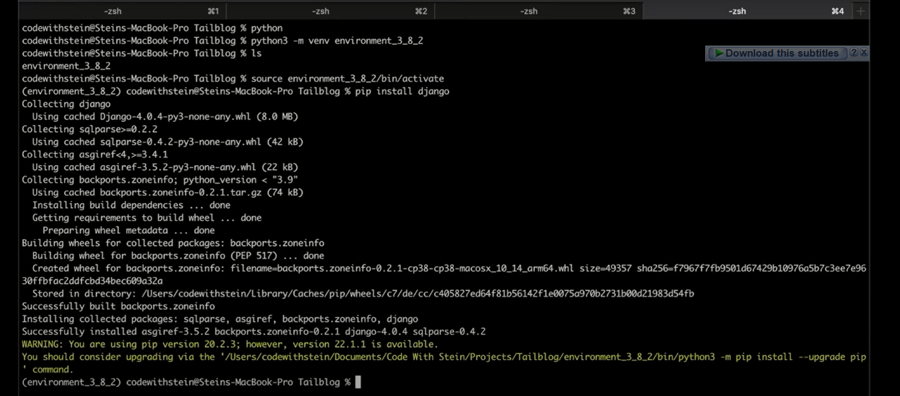
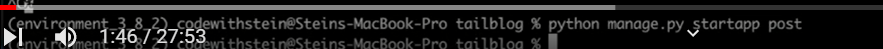

# start your virtual environment

create new project
enter the project
list to see component

then migrate

JUST LIKE YOU SEE IT HERE

SETTLE THE ADMIN BY USING THE COMMAND HERE

FILL IN THE USERNAME AND RUN SERVER

QUIT IT AND CREATE ANOTHER MICROSERVICE INSIDE IT CALLED POST

ADD YOUR NEW MICROSERVICE TO THE LIST OF MICROSERVICE
THE EXAMPLE USED POST

WE CREATE THE CLASS FOR THE MODELS IN THE MICROSERVICE AND MIGRATE

WE CREATED 2 CLASSES
CATEGORY´´TITLE
AND POSTS´´CARTEGORY,TITLE,SLUG,INTRO,BODY,CREATED AT,
 
